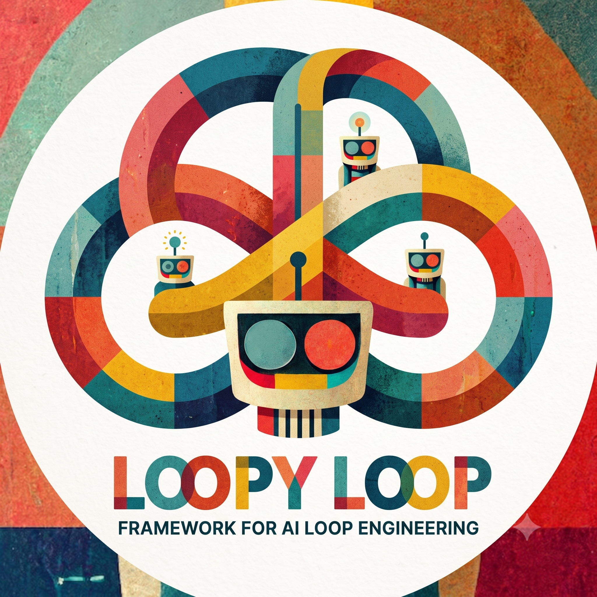

# loopy-loop

<p align="center">
  
</p>

`loopy-loop` runs long-running AI agent workflows inside your repository.
It turns a goal file in your repository into an inspectable sequence of agent
iterations: plan, implement, evaluate, record evidence, and continue until the
goal is met or the loop hits a terminal blocker.

The value is control and durability. Instead of asking one agent to solve a
large task in one fragile chat, loopy-loop gives the work a persistent session
directory, repeatable workflow prompts, explicit stop conditions, and structured
logs. You can pause, resume, audit what happened, adjust the goal, inspect every
prompt/result pair, and keep the actual project changes in normal git branches
and PRs.

Under the hood, loopy-loop runs a small FastAPI coordinator and a single
worker. The coordinator owns the loop state and chooses the next workflow. The
workers run assignments through
[`team-harness`](https://github.com/writeitai/team-harness), which can delegate
to agent CLIs such as Codex, Claude Code, and Gemini. The packaged
`inner_outer_eval` template also uses
[`eval-banana`](https://github.com/writeitai/eval-banana) conventions for
session-scoped evaluation checks; eval-banana installs automatically as a
loopy-loop dependency.

## Install

Install the CLI from the official [PyPI package](https://pypi.org/project/loopy-loop/).

With `uv`, install it as a command-line tool:

```bash
uv tool install loopy-loop
```

Or with `pip`:

```bash
pip install loopy-loop
```

For development inside this repository:

```bash
uv sync --extra dev
```

## Install the Agent Skill

This repo also ships an [Agent Skill](https://support.claude.com/en/articles/12512176-what-are-skills)
that teaches Claude Code, Codex, and compatible agents how to set up and run
loopy-loop in another target repo.

```bash
npx skills add https://github.com/writeitai/loopy-loop --skill loopy-loop
```

The skill source lives under [`skills/loopy-loop/`](./skills/loopy-loop/SKILL.md).

## Initialize a Target Repo

Run this from the repository you want agents to work on:

```bash
loopy init --template inner_outer_eval
```

This is the recommended starting template. It creates:

- `loopy_loop_config.yaml`
- `loopy_loop_goal.txt`
- `.loopy_loop/workflow_sets/inner_outer_eval/workflows/outer/`
- `.loopy_loop/workflow_sets/inner_outer_eval/workflows/inner/`
- `.loopy_loop/workflow_sets/inner_outer_eval/workflows/eval_reviewer/`
- `.loopy_loop/workflow_sets/inner_outer_eval/workflows/eval_runner/`
- a `.gitignore` entry for `.loopy_loop/sessions/`

`loopy init` is idempotent. It creates missing files and leaves existing files
alone.

## Write the Goal

The loop goal lives in `loopy_loop_goal.txt`. Replace the scaffolded example
with the real target, including constraints and observable completion criteria.

Example:

```text
Implement passwordless email login.

Completion criteria:
- Users can request a one-time login link from the sign-in page.
- The link expires after 15 minutes and cannot be reused.
- Existing password login keeps working.
- Tests cover token expiry, token reuse, and successful login.
- README documents required environment variables.
```

Keep the goal specific enough that a reviewer or eval workflow can decide
whether the loop is done. For one-off overrides, start the coordinator with
`--goal-file PATH`; the file is copied into the session as `goal.md`.

## Run the Loop

Start the coordinator in one terminal:

```bash
loopy coordinator --host 127.0.0.1 --port 8080
```

Start a worker in another terminal:

```bash
loopy worker --coordinator http://127.0.0.1:8080
```

Useful control commands:

```bash
loopy status
loopy stop
```

If the coordinator stops while a session is still running, restart it with:

```bash
loopy coordinator --host 127.0.0.1 --port 8080 --resume
```

The default templates use `team_harness_provider: "codex"`, so the coordinator
uses local Codex authentication. If you switch to an OpenAI-compatible provider,
export the environment variable named in `team_harness_api_key_env`, usually
`OPENROUTER_API_KEY`, in both the coordinator and worker shells.

## How It Works

At a high level:

1. `loopy init` writes a root config, a goal file, and workflow files into the
   target repo.
2. `loopy coordinator` loads `loopy_loop_config.yaml`, resolves the goal text,
   creates a session under `.loopy_loop/sessions/`, and exposes two HTTP
   endpoints: `/register` and `/finished`.
3. A worker calls `/register`, receives the next workflow assignment, renders
   the workflow prompt with session paths, and runs it through `team-harness`.
4. `team-harness` runs a coordinator model and can spawn external worker CLIs
   such as Codex, Claude Code, or Gemini.
5. The worker writes the rendered prompt, normalized result, result text,
   harness run id, and harness output path into the iteration directory.
6. The coordinator records the result, checks session control/eval artifacts,
   and either dispatches the next workflow or stops.

The `inner_outer_eval` template is organized around four workflows:

- `outer`: plans, tracks durable project state, reviews evidence, and decides
  what should happen next.
- `inner`: implements the selected work in the target repo.
- `eval_reviewer`: creates or refreshes session-scoped eval-banana checks.
- `eval_runner`: runs the eval checks and writes `goal_check.json`.

The loop does not hide state inside a chat transcript. Continuity comes from
git state plus files in `.loopy_loop/sessions/<session_id>/`.

## Repo Layout

After initialization, the target repo has this shape:

```text
target repo/
├── loopy_loop_config.yaml
├── loopy_loop_goal.txt
└── .loopy_loop/
    ├── workflow_sets/
    │   └── <workflow_set>/workflows/<workflow_id>/
    │       ├── config.yaml
    │       └── prompt.txt
    └── sessions/
        └── <session_id>/
            ├── goal.md
            ├── session.json
            ├── state.json
            ├── control.json
            ├── updates_from_user.md
            ├── project_state/
            ├── eval_checks/
            ├── eval_results/
            ├── harness_outputs/
            ├── child_requests/
            ├── children/
            └── iterations/
```

Workflow definitions are part of the repo and should usually be committed.
Session directories are runtime output and are ignored by default.

## Configuration

Root config lives at `loopy_loop_config.yaml`:

```yaml
goal_file: loopy_loop_goal.txt
workflow_set: inner_outer_eval
max_turns: 160
goal_check_consecutive_failures_cap: 3
team_harness_provider: "codex"
team_harness_model: "gpt-5.5"
team_harness_agents:
  - "codex"
  - "claude"
  - "gemini"
team_harness_agent_models:
  codex: "gpt-5.5"
  claude: "claude-opus-4-8"
  gemini: "gemini-3.5-flash"
team_harness_agent_reasoning_efforts:
  codex: "high"
team_harness_api_base: "https://openrouter.ai/api/v1"
team_harness_api_key_env: "OPENROUTER_API_KEY"
```

Important rules:

- `workflow_set` selects the default workflow set for new sessions.
- `goal_file` is resolved relative to `loopy_loop_config.yaml`.
- Inline `goal` values in YAML are rejected; the goal should live in a file.
- `max_turns` is the maximum number of completed workflow iterations.
- `team_harness_model` controls the team-harness coordinator model.
- `team_harness_agent_models` controls default models for worker subprocesses.
- `team_harness_api_base` is normalized by loopy-loop: trailing slash stripped,
  `/v1` appended when missing.
- `team_harness_max_retries`, `team_harness_retry_base_delay_s`, and
  `team_harness_retry_max_delay_s` are optional retry controls for transient
  team-harness API/network errors.
- `recovery_policy` (`drain` by default, or `reap`) and
  `recovery_drain_timeout_s` control what crash recovery does with agent
  processes a dead worker left running: drain lets them finish (one shared
  bounded deadline) before the iteration is re-run; reap kills them
  immediately. These are coordinator-side settings and are not part of the
  config snapshot sent to workers.

Workflow config lives beside each workflow prompt:

```yaml
enabled: true
priority: 0
run_every: 1
must_follow: null
not_before_iteration: 0
run_on_start: false
run_after_successes: null
emits_goal_check: false
description: ""
```

Workflow rules:

- The workflow id is the folder name under
  `.loopy_loop/workflow_sets/<workflow_set>/workflows/`.
- `priority` breaks ties among eligible workflows; higher values run first.
- `run_every` is based on completed iteration count, not wall clock.
- `run_on_start=true` makes a workflow eligible before any successful workflow
  has run.
- `must_follow` and `run_after_successes.workflow_id` must reference existing
  workflow ids.
- `run_after_successes` can schedule a workflow after every N successful runs
  of another workflow:

```yaml
run_after_successes:
  workflow_id: inner
  every: 10
```

- `emits_goal_check=true` lets a non-`goal_check` workflow write
  `goal_check.json` as an eval artifact. Stopping still requires updating
  session `control.json`.

## Output and Logging

Each fresh coordinator run creates one session directory:

```text
.loopy_loop/sessions/<session_id>/
```

Session ids start with a UTC timestamp and include a deterministic goal hash, so
session directories sort chronologically and similar goals are easy to compare.

Important session files:

- `goal.md`: the exact goal text copied into the session.
- `session.json`: session metadata.
- `state.json`: coordinator-owned dispatch state.
- `events.jsonl`: reserved append-only diagnostics log.
- `control.json`: workflow-owned stop switch.
- `updates_from_user.md`: human-writable inbox for changes after the session
  starts.
- `project_state/`: workflow-owned durable markdown state.
- `eval_checks/`: session-scoped eval-banana checks.
- `eval_results/`: raw eval-banana reports.
- `harness_outputs/`: team-harness coordinator and worker artifacts.
- `iterations/`: one directory per loopy-loop assignment.

Each iteration directory contains:

```text
.loopy_loop/sessions/<session_id>/iterations/<NNNN>_<workflow_id>/
├── prompt.txt
├── result.json
├── result_text.txt
├── harness_run_id.txt
├── pending_finished_request.json
└── goal_check.json            # only for eval-emitting workflows
```

`prompt.txt` is the rendered prompt sent to `TeamHarness.run(...)`.
`result.json` is loopy-loop's normalized result. `result_text.txt` is the
plain-text final response. `harness_run_id.txt` links the iteration to the
corresponding team-harness output under `harness_outputs/`.

Team-harness outputs are routed here:

```text
.loopy_loop/sessions/<session_id>/harness_outputs/<NNNN>_<workflow_id>/<team_harness_run_id>/
```

Eval-banana outputs should be routed here:

```text
.loopy_loop/sessions/<session_id>/eval_results/<eval_banana_run_id>/
```

See [docs/session-layout.md](docs/session-layout.md) for the full session file
contract.

## Control and Completion

`control.json` is the session-scoped stop switch. It starts as:

```json
{
  "state": "running",
  "reason": "session active",
  "stop_reason": null,
  "schema_version": 1
}
```

To stop successfully, a workflow writes:

```json
{
  "state": "stopped",
  "reason": "evals passed",
  "stop_reason": "goal_met",
  "schema_version": 1
}
```

To stop because the loop cannot continue:

```json
{
  "state": "stopped",
  "reason": "specific terminal blocker",
  "stop_reason": "unresolvable_error",
  "schema_version": 1
}
```

`goal_check.json` is a per-iteration eval artifact:

```json
{"goal_met": false, "reason": "docs still missing", "schema_version": 1}
```

A valid `goal_check.json` does not stop the loop by itself. It is evidence.
Stopping is controlled by session `control.json`. If goal-check output is
missing or invalid repeatedly, the coordinator stops with
`stop_reason="goal_check_broken"` after the configured failure cap.

## Workflow Sets and Child Sessions

Workflow sets are mandatory. Even a single-loop repo uses:

```text
.loopy_loop/workflow_sets/main/workflows/...
```

The older `.loopy_loop/workflows/...` layout is not loaded.

A workflow can request one sequential child session by writing a JSON file under
the active session's `child_requests/` directory:

```json
{
  "workflow_set": "pm_planner_dispatcher",
  "goal": "Implement the selected planner item.",
  "schema_version": 1
}
```

The coordinator creates the child session under the parent session's
`children/` directory, copies the request goal into the child `goal.md`, runs
the requested workflow set, and resumes the parent after the child reaches a
terminal state. v1 is depth-first and single-child-at-a-time.

The packaged `pm_planner_dispatcher` workflow set uses this contract for PM
orchestration:

- `planner` maintains PM state, selects one work item, and reviews terminal
  child-session evidence.
- `dispatcher` writes one child request for the selected work item or imports
  terminal child evidence back into PM state.

## HTTP Contract

The coordinator exposes exactly two endpoints:

- `POST /register`
- `POST /finished`

Both return a `TaskResponse` with `action` equal to `"run"` or `"stop"`.

A `run` response carries `workflow_set`, `workflow_id`, `session_id`,
`iteration`, and a config snapshot. A `stop` response carries `stop_reason`.

If `/finished` receives a stale response for a task that is no longer current,
the coordinator does not mutate state. If a worker exits after writing
`result.json` but before `/finished` is acknowledged, the next `/register`
recovers the completed result from the iteration directory instead of marking
the task abandoned.

See [docs/http-contract.md](docs/http-contract.md) for exact JSON payloads.

## CLI Reference

```bash
loopy init [--template default|inner_outer_eval|pm_planner_dispatcher]
```

Scaffolds loopy-loop files. The default template creates only the reserved
`goal_check` workflow. `inner_outer_eval` creates the recommended outer/inner/eval
workflow set. `pm_planner_dispatcher` creates planner/dispatcher workflows for
child-session orchestration — and also ships the `inner_outer_eval` child set
its dispatcher spawns, so a clean init is executable end to end.

```bash
loopy coordinator --host 0.0.0.0 --port 8080 [--resume] [--workflow-set NAME] [--goal-file PATH]
```

Runs the coordinator. `--workflow-set` and `--goal-file` override the root
config for the new session. `--resume` reuses a non-terminal latest session.

```bash
loopy worker --coordinator http://127.0.0.1:8080
```

Runs a blocking worker until the coordinator returns `action: "stop"`.

```bash
loopy status
loopy stop
```

`status` prints the latest session state. `stop` sets `stop_requested=true` in
the latest session-local state.

## Related Projects

- [`team-harness`](https://github.com/writeitai/team-harness): the model and
  agent-CLI orchestration layer used by loopy-loop workers.
- [`eval-banana`](https://github.com/writeitai/eval-banana): a lightweight YAML
  evaluation framework used by the packaged eval workflows. Installed
  automatically as a loopy-loop dependency.
