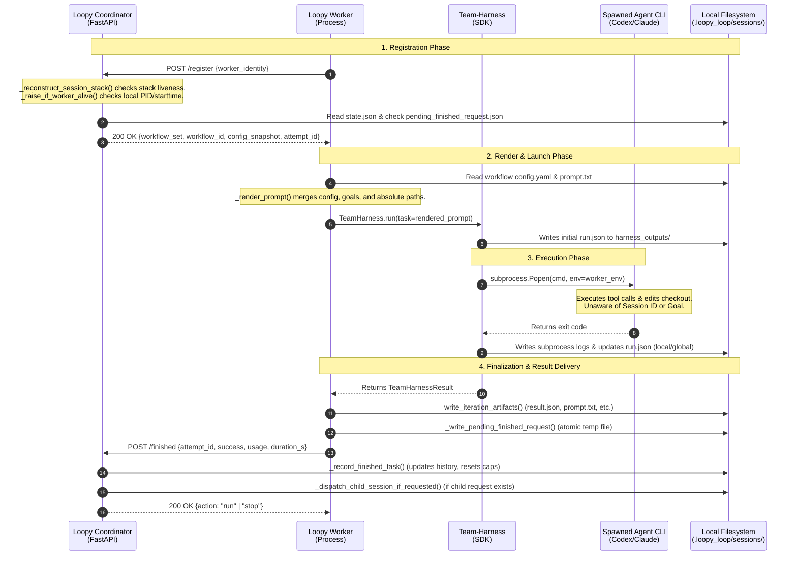

# Independent Architecture & Contract Audit: Antigravity Loop
**Date:** July 15, 2026  
**Auditor:** Antigravity AI Coding Assistant  
**Repository Target:** [loopy-loop](../../README.md)  
**Status:** Completed Analysis  

> **Independent pass; not the adjudicated recommendation.** The sequence
> diagram and Priority 2 below incorrectly state that team-harness 0.4.0 puts
> its canonical `run.json` under session `harness_outputs/`. It writes that
> record under `~/.team-harness/runs/<run_id>/run.json`; only spawned-worker
> artifacts are session-local. Repointing recovery to the session path would
> therefore break it. The direct cloud streaming, engine git rejection, and
> stock mandatory deterministic-gate suggestions below are also not adopted
> because they conflict with the local-first trace contract or D4/D8. See the
> [consolidated review](./loop-layer-state-and-trace-contract.md) for verified
> findings and disposition.

---

## 1. Executive Verdict

The current architecture of `loopy-loop` (versions 0.3.0 to 0.6.0) presents a robust, file-backed stateful stack machine that coordinates long-running AI workflows inside a local repository. By declaring git commits and filesystem artifacts as the single source of truth, it avoids the fragility of long-lived chat transcripts and enables crash recovery, task resume, and child session spawning.

However, the architecture contains a **significant structural boundary gap**: the contract between the `loopy-loop` coordinator/worker, the `team-harness` execution layer, and the spawned agent CLIs (e.g., Claude Code, Codex, Gemini) is **highly implicit and unstructured**. 
- **Context Siloing:** Spawned agents execute with zero structured metadata or awareness of the owning session, task iteration, parent goal, depth level, or local artifact directories. They rely entirely on parsing unstructured prose rendered in the prompt.
- **Process & Trace Coupling:** Recovery and trace analysis are heavily coupled to the local host's filesystem and process-group APIs (via team-harness `RUNS_DIR` and local PIDs). A remote worker degrades to legacy abandonment, preventing verified execution isolation.
- **Evaluation Concentration:** The final acceptance of iterations is concentrated entirely on a single LLM-as-judge check (`harness_judge`) without deterministic, repo-owned suite validation by default.

### Verdict Summary
`loopy-loop` is highly fit for purpose as a local, repository-centric developer loop. To transition to a scalable, production-grade cloud execution environment or to safely run a sequential **triple loop** (PM Backlog $\rightarrow$ Epic Feature $\rightarrow$ Code Ticket), the runtime must decouple execution logs from local system state, propagate session context to spawned agents via structured env vars, and enforce strict, repo-owned deterministic backstops under the LLM judge.

---

## 2. Sequence and Ownership Map

The system separates concerns across three tiers: `loopy-loop` (the state coordinator and worker orchestrator), `team-harness` (the agent run manager), and individual **spawned agent CLIs** (the execution workers). 



### Roles and Mutator Ownership
- **Loopy Coordinator (FastAPI):** Exposes `/register` and `/finished`. Owns the lock on session state mutations. It is the only entity authorized to read/write `state.json`, update `children.json`, verify worker hostname/PID liveness, and transition the active stack pointer.
- **Loopy Worker:** Runs as a CLI process. Fetches assignments, renders the prompt text, executes `team-harness`, writes the local iteration directory (e.g., [result.json](../../src/loopy_loop/sessions.py#L28)), and posts the result back. It does not write to parent state records.
- **Team-Harness:** An SDK executed by the worker. It manages the lifecycle of agent CLI subprocesses, maps models to config, monitors API token counts, and handles process-group cleanups (drain/reap). It writes trace-dense `run.json` execution logs.
- **Spawned Agents:** External CLI binaries (Claude Code, Codex, Gemini). They have direct write access to the working tree. They do not know they are inside `loopy-loop` and communicate purely through stdout/stderr and file changes.

---

## 3. Missing or Ambiguous Contracts

### A. Context Propagation to Spawned Agents
- **The Gap:** Neither `loopy-loop` nor `team-harness` passes structured context variables (e.g., `LOOPY_SESSION_ID`, `LOOPY_ITERATION`, `LOOPY_DEPTH`, `LOOPY_TARGET_GOAL`) as environment variables or command-line parameters to the spawned agent CLIs.
- **Consequence:** The spawned agents can only extract context by parsing the long, unstructured `rendered_prompt` prose (handled by [worker.py:_render_prompt](../../src/loopy_loop/worker.py#L367-L420)). If an agent needs to write custom evaluation checks to `eval_checks/` or child requests to `child_requests/`, it must rely on regex matches in the prompt text. If a model fails to parse these paths correctly, it writes to the wrong directories or fails to communicate with the coordinator.
- **Risk:** High. An agent can easily overwrite protected session files (e.g., `state.json` or `control.json`) since it runs in the repo root without path-level write enforcement.

### B. Git Branch and PR Lifecycle Boundaries
- **The Gap:** The engine relies on prompts to guide branch creation, PR submittal, and merging (e.g., [SKILL.md:L391](../../skills/loopy-loop/SKILL.md#L391)). The engine does not monitor git state.
- **Consequence:** If an agent creates a branch but fails to record the PR URL in `finished.md`, or if a merge conflict blocks execution, the coordinator cannot detect this programmatically. It has to wait for an LLM-judge to notice, which is slow and prone to errors.
- **Risk:** Medium. Re-running or recovering tasks can cause git branch divergence or commit duplication, as there is no deterministic check that git is clean or aligned with `state.json`.

### C. Harness Output and Global Runs Directory Coupling
- **The Gap:** `recovery.py` relies on `team_harness.config.RUNS_DIR` to read the run record during worker crash recovery (see [recovery.py:L155](../../src/loopy_loop/recovery.py#L155)).
- **Consequence:** `RUNS_DIR` is a global system directory (e.g., `~/.team-harness/runs/`). If a worker executes on a separate host (remote buildbox), the coordinator process cannot access the worker's `RUNS_DIR`.
- **Risk:** High for distributed architectures. The liveness proof and process group reaping degrade to "unknown", rendering the coordinate-level double-worker safety (HTTP 409) and orphan agent recovery useless.

---

## 4. State-versus-Trace Schema Projections

The repository currently mixes durable semantic state (decisions, accepted files) and execution telemetry (token usage, durations). For clean operations and cloud trace exports, these must be partitioned into two distinct planes:

```
+-----------------------------------------------------------------------------------+
| DURABLE SEMANTIC STATE & EVIDENCE PLANE (loopy-loop)                              |
| - File: state.json, control.json, children.json                                   |
| - Key Properties: Versioned, human-auditable, git-aligned, small, checkpointed.   |
| - Focus: WHAT was decided, WHAT was built, and WHY did the loop stop.             |
+-----------------------------------------------------------------------------------+
                                         |
                                         | Links via iteration_id + attempt_id
                                         v
+-----------------------------------------------------------------------------------+
| EXECUTION TRACES & LOGS PLANE (team-harness)                                      |
| - File: harness_outputs/run.json, stdout/stderr, subprocess logs                  |
| - Key Properties: Highly granular, append-only, high throughput, ephemeral.       |
| - Focus: HOW did the LLMs interact, what commands ran, what did API calls cost.   |
+-----------------------------------------------------------------------------------+
```

### Propose: Cloud Trace Export Contract Schema
To support external telemetry providers (e.g., Langfuse, GCP Cloud Tasks, OpenTelemetry), we propose a unified JSON Schema for exporting loop executions.

```json
{
  "$schema": "http://json-schema.org/draft-07/schema#",
  "title": "LoopyLoopCloudTraceEnvelope",
  "type": "object",
  "required": ["trace_id", "span_id", "session_metadata", "execution_telemetry"],
  "properties": {
    "trace_id": { "type": "string", "description": "Unique ID for the top-level session run" },
    "span_id": { "type": "string", "description": "Unique ID for the current execution unit (iteration or child session)" },
    "parent_span_id": { "type": ["string", "null"], "description": "Links child sessions/iterations to parent span" },
    "session_metadata": {
      "type": "object",
      "required": ["session_id", "workflow_set", "workflow_id", "iteration", "attempt_id", "depth"],
      "properties": {
        "session_id": { "type": "string" },
        "workflow_set": { "type": "string" },
        "workflow_id": { "type": "string" },
        "iteration": { "type": "integer" },
        "attempt_id": { "type": "string" },
        "depth": { "type": "integer", "minimum": 0 }
      }
    },
    "execution_telemetry": {
      "type": "object",
      "required": ["started_at", "finished_at", "success", "failure_kind", "usage", "worker_identity"],
      "properties": {
        "started_at": { "type": "string", "format": "date-time" },
        "finished_at": { "type": "string", "format": "date-time" },
        "success": { "type": "boolean" },
        "failure_kind": { "type": "string", "enum": ["none", "transient", "deterministic", "crash", "unknown"] },
        "duration_s": { "type": "number" },
        "usage": {
          "type": "object",
          "properties": {
            "prompt_tokens": { "type": "integer" },
            "completion_tokens": { "type": "integer" },
            "turns": { "type": "integer" }
          }
        },
        "worker_identity": {
          "type": "object",
          "properties": {
            "hostname": { "type": "string" },
            "pid": { "type": "integer" }
          }
        }
      }
    },
    "payloads": {
      "type": "object",
      "properties": {
        "rendered_prompt": { "type": "string" },
        "response_text": { "type": "string" },
        "goal_check_verdict": {
          "type": "object",
          "properties": {
            "goal_met": { "type": "boolean" },
            "reason": { "type": "string" }
          }
        }
      }
    }
  }
}
```

---

## 5. One, Double, and Triple Loop Analysis

```
ONE LOOP (Flat code loop)
  [Outer Plan] -> [Inner Implement] -> [Eval Run] -> [Loop back]
  - Context Size: Grows rapidly; implementation details pollute planning context.

DOUBLE LOOP (PM / Dispatcher)
  [Parent PM Session (Backlog & Goals)]
     |
     +--> [Child Session (Scoped Implementation & Eval)] (e.g., inner_outer_eval)
  - Context Size: Decoupled. Child starts with clean context; parent holds state.

TRIPLE LOOP (Epics / Tickets)
  [Parent PM (Epics & Roadmap)]
     |
     +--> [Child PM (Feature Specs & Backlog)]
            |
            +--> [Grandchild Session (Task-scoped Code & Evals)]
  - Context Size: Maximum isolation. Requires structured depth bounds and propagation.
```

### A. State Stack Depth & Recursion Contract
- **Current Behavior:** The coordinator supports a depth-first, two-level stack. Walk limits are hardcoded to block recursion past depth 1 (i.e., parent session and one active child session). If a child session writes a request to `child_requests/`, the file is scanned but ignored during dispatch.
- **Redesign for Triple Loop:** To support grandchildren sessions (depth 2), the parent-child pointer walk in `_reconstruct_session_stack` (see [coordinator_app.py:L822](../../src/loopy_loop/coordinator_app.py#L822)) must be extended.
  - The walk in `_reconstruct_session_stack()` already loops iteratively using `while True`, which theoretically supports arbitrary depth.
  - The blocker is that `_dispatch_child_session_if_requested` strictly checks:
    ```python
    if state.parent_session_id is not None:
        return None
    ```
    This prevents any child session from spawning its own child.
  - **Proposed Amendment:** Change the hard blocker to a configurable max depth: `if state.depth >= max_depth: return None`.

### B. Nested State Ownership
- In a triple loop, the grandchild owns the code files and test results.
- The child (Feature Epic Planner) owns the feature specifications and validates the grandchild's evidence.
- The parent (PM) owns the overall backlog and validates the child's evidence.
- **Rule:** A grandchild must never directly read or write parent PM files. It must only communicate via its parent's inbox (`child_requests/` and `children/`).

### C. Crash Recovery and Resume in a Triple Loop
- **Verification:** Since `_reconstruct_session_stack()` is already a recursive pointer walk, a coordinator restart will successfully locate the deepest active grandchild.
- **Blocker:** If the grandchild crashes, recovery must verify that the grandchild's worker is dead before the child dispatcher can reclaim or redispatch. If local-host tracking is disabled, a grandchild crash can cascade up, causing the parent to think the entire epic is abandoned. Bounded drain timeouts must be scaled down at deeper depths to prevent timeouts from compounding (e.g., if parent timeout is 10 min, child must be 5 min, grandchild must be 2 min).

### D. Parent Consumption of Child Evidence
- When a grandchild completes, its subtree usage (tokens, duration) is rolled up to the child. When the child completes, its accumulated usage (including grandchild spend) is rolled up to the parent. This prevents double-counting while preserving total billing observability.

---

## 6. Evaluation and Git/PR Analysis

### A. The LLM-as-Judge Constraint
- **Current Practice:** In the `inner_outer_eval` template, the evaluation reviewer is prohibited from authoring deterministic checks (see [Decision D4](../../design/decisions.md#L94)). All checks run as `harness_judge` (LLM-as-judge).
- **The Defect:** Relying solely on `harness_judge` makes the loop prone to hallucinations, false positives, and self-gaming.
- **The Solution:** D4 correctly notes that *agent-authored* deterministic checks are garbage, but *repository-owned* contract tests (e.g., `pytest`, lint runners) are trustworthy. The eval contract should enforce a dual-gate:
  1. **Qualitative Gate:** `harness_judge` checks the natural language criteria (UI alignment, docs).
  2. **Quantitative Gate:** A deterministic checker runs the pre-existing test suite. A failure in the test suite *must* veto any positive LLM judgment.

### B. Git Branch, PR, and Merge State Tracking
- **The Gap:** The coordinator has no awareness of git state.
- **Trace Analysis:**
  - Standard implementation workflows checkout a fresh branch (`feature/xyz`) and open a PR.
  - The loop continues even if the PR checks are red (cadence is independent of git).
  - **Proposed Improvement:** Render git state directly into the coordinator prompt. The worker can run `git status` and `git log` and attach the output to `/finished` metadata. The coordinator can reject/retry iterations if the git working tree becomes dirty or divergent, avoiding the "mystery diff" problem during recovery.

---

## 7. Cloud Export Considerations

When exporting traces to a cloud console or database, several design criteria must be met:

### A. Trace Data Payload
- To capture the execution without polluting the target repository with logs, trace data should bypass the local disk and stream directly from the worker to the cloud collector.
- Every HTTP `/finished` payload should contain a nested `trace` block conforming to the schema in Section 4.

### B. Local Artifact Isolation & Gitignore Rules
- Harness artifacts (raw LLM completion logs, terminal input history) are voluminous and must remain separated from code.
- **Rule:** The `harness_outputs/` directory must be kept inside `.loopy_loop/sessions/` (which is gitignored by default: [L6](../../.gitignore#L6)).
- A cloud exporter should read from `harness_outputs/` and stream to an object storage bucket (e.g., AWS S3 or GCS) rather than retaining it on the local runner.

### C. Cloud Export Contract
- The coordinator should accept an optional `cloud_trace_endpoint` URL in `loopy_loop_config.yaml`.
- When configured, `coordinator_app.py` sends an async, fire-and-forget POST request with the trace payload after every successful `state.json` mutation.

---

## 8. Concrete Recommendations

### Priority 1: Propagate Structured Context to Subprocesses (P0)
- **Problem:** Spawned agents are blind to the session context and paths.
- **Action:** Modify the worker's execution environment. Ensure that when team-harness is invoked, the worker sets environment variables:
  - `LOOPY_SESSION_ID`
  - `LOOPY_ITERATION`
  - `LOOPY_DEPTH`
  - `LOOPY_SESSION_DIR`
- **Code Anchor:** [worker.py:_run_task](../../src/loopy_loop/worker.py#L186)
- **Prompt Anchor:** [dispatcher/prompt.txt:L82](../../src/loopy_loop/templates/pm_planner_dispatcher/.loopy_loop/workflow_sets/pm_planner_dispatcher/workflows/dispatcher/prompt.txt#L82)

### Priority 2: Decouple Recovery from Global `RUNS_DIR` (P0)
- **Problem:** Coordinator recovery fails for remote workers because it depends on the local path `th_config.RUNS_DIR`.
- **Action:** Update the reaper lookup in `recovery.py` to check the local session's `harness_outputs/` directory instead of the system-wide runs directory. The worker already sets `output_dir` in `harness_kwargs`, so the runs are fully self-contained in the session workspace.
- **Code Anchor:** [recovery.py:_discover_run_ids](../../src/loopy_loop/recovery.py#L225)

### Priority 3: Support Configure-Level Max Depth (P1)
- **Problem:** Double-loop is locked to depth 1, preventing triple-loop experiments.
- **Action:** Replace the parent check `if state.parent_session_id is not None` in `coordinator_app.py` with a configurable `max_depth` check loaded from the root configuration.
- **Code Anchor:** [coordinator_app.py:_dispatch_child_session_if_requested](../../src/loopy_loop/coordinator_app.py#L1029)

### Priority 4: Implement Dual-Gate Evaluation (P1)
- **Problem:** Relying solely on LLM-as-judge permits broken code to pass.
- **Action:** Update the `eval_runner` prompt template to require running the target repo's own test command first, and verify the exit code is 0 before calling the `harness_judge`.
- **Prompt Anchor:** [inner_outer_eval templates](../../src/loopy_loop/templates/inner_outer_eval/)

---

## 9. Alternatives and Tradeoffs

### Alternative A: Run Spawned Agents in an Isolated Container/Sandbox
- **Tradeoff:** Enforcing a preventive write fence (e.g., running spawned agents in Docker) would align with security best practices. However, it directly violates **D8 (detection rather than prevention)** and prevents agents from mutating the target checkout. It also adds heavy tooling overhead.
- **Verdict:** Rejected. Detection via git diff validation is simpler and preserves agent autonomy.

### Alternative B: Direct Coordinator-to-Cloud Telemetry Stream
- **Tradeoff:** Having the coordinator push traces directly to the cloud minimizes local disk writes. However, it introduces network dependencies to the coordinator loop. If the cloud endpoint is slow or down, the coordinator could block.
- **Verdict:** Accepted with async, non-blocking HTTP threads.

---

## 10. Code and Prompt Anchors

- **Loop Transition Lock & Mutator:** [coordinator_app.py:L482-584](../../src/loopy_loop/coordinator_app.py#L482-L584)
- **Durable Pointer Walk:** [coordinator_app.py:L822-880](../../src/loopy_loop/coordinator_app.py#L822-L880)
- **Orphan Recovery Process Check:** [recovery.py:L118-205](../../src/loopy_loop/recovery.py#L118-L205)
- **Prompt Rendering absolute paths:** [worker.py:L367-421](../../src/loopy_loop/worker.py#L367-L421)
- **Binding decisions on success & judgment:** [decisions.md (D3, D4, D8)](../../design/decisions.md)
